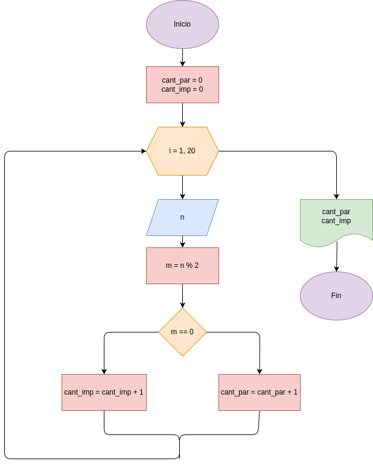
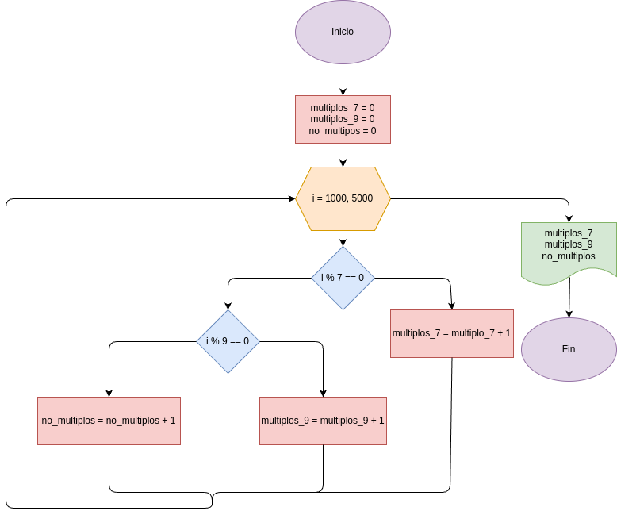

# Numeros-pares-e-impares
Programa en Python que lea 20 números enteros y que imprima cuantos son pares y cuantos son impares

## Análisis

### Variable de entrada
- n

### Procesamiento
- cant_par = 0
- cant_imp = 0
- i = 1, 20
- m = n % 2
- m == 0

### Variables de salida
- cant_par
- cant_imp

## Diseño

## Construcción
- Codigo implementado en el archivo programa.py

# Ejercicio No 2
Programa en Python para averiguar e imprimir cuantos multiplos de 7, y cuantos multiplos de 9 hay en los números comprendidos entre 1000 y 5000

## Análisis

### Procesamiento
- multiplo_7 = 0
- multiplo_9 = 0
- no_multiplos = 0
- i = 1000, 5000
- i % 7 == 0
- i % 9 == 0
- i % 7 != 0 and i% 9 != 0

### Varibales de salida
- multiplo_7
- multiplo_9
- no_multiplo

## Diseño

## Construcción
- codigo implementado en el archivo programa2.py